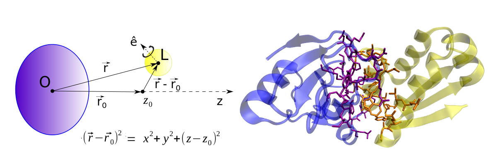

# APPFEL.py

The Automated Protein-Protein Free Energy tooL (APPFEL.py) is a python tool designed to calculate the affinity of a receptor-ligand complex made of two polypeptide chains. It takes advantage of the collective variables module from the simulation software NAMD, which can apply a sophisticated set of harmonic restraints to multiple groups of atoms. 

APPFEL can perform absolute binding free energy (ABFE) calculations starting only from the pdb structure of the complex, with all the needed steps to build and simulate the systems being performed in a fully automated way. 
  

# Getting started

To use APPFEL.py, download the files from this repository, which already contain an example of a protein-protein system that will be used for this tutorial. In order to perform all the steps in the calculation, the following programs must be installed and in your path:

NAMD (NAnoscale Molecular Dynamics) versions 2.13 or 2.14 [1] - https://www.ks.uiuc.edu/Development/Download/download.cgi?PackageName=NAMD - *If the user has a graphics processing unit (GPU), we recommend downloading the CUDA version of the NAMD software.*

VMD (Visual Molecular Dynamics) [2] - https://www.ks.uiuc.edu/Development/Download/download.cgi?PackageName=VMD

MUSTANG v3.2.3 (MUltiple (protein) STructural AligNment alGorithm) [3] - http://lcb.infotech.monash.edu.au/mustang/

AmberTools20 or later [4] - http://ambermd.org/AmberTools.php

The folder APPFEL/structures contains the initial structure of the complex, which will be the starting point of the calculations. The APPFEL/build\_files and APPFEL/namd\_files folders contain the CHARMM36 topology and parameters needed to build and simulate the systems. Additional force-field options, such as AMBER, will be added to APPFEL workflow in the near future. 

Even though Ambertools is not needed for parameter generation at the moment, the python 3.8 version from AMBER's miniconda contains all the necessary modules to run APPFEL, such as *numpy* and *scipy*. Installing Ambertools might be simpler when compared to downloading, installing and adding each module to the python path. 

# Running a sample calculation

In this tutorial we will perform a sample calculation on a well-known protein-protein system (PDB code 1brs), which will be carried out inside the ./APPFEL/ folder from the APPFEL distribution. The whole procedure requires no manual steps and is divided in four stages: equilibration, steered molecular dynamics (SMD), running the free energy windows, and analyzing them to obtain the desired binding free energy.  

The tutorial shown here is an example calculation that can be readily reproduced without any adjustments to the code or the input files. The theory and methods behind APPFEL, the meaning of each input parameter, and how to add new systems to the automated workflow, can be found in the software's User Guide, located inside the ./doc/ folder. 

## Equilibration

The equilibration step starts from the initial complex pdb structure, first gradually heating the system, and then performing a simulation with no restraints applied to the ligand. To run this step, inside the ./APPFEL/ folder type:

python APPFEL.py -i input.in -s equil

APPFEL is compatible with python 3.8 versions. If you have another version, or you find that this command gives an error (such as the absence of one or more modules), you can use the python version included in the Ambertools20 distribution:

$AMBERHOME/miniconda/bin/python APPFEL.py -i input.in -s equil

This command will create an ./equil/1brs/ folder, in which the equilibrium simulations will be performed. In order to run the simulations locally, APPFEL provides an example bash script called *run-eq.bash*, which can be edited to match the user's hardware, such as the number of available CPUs. One can also create their own PBS script to run the simulations in a queue system such as TORQUE, using their particular server definitions. 

## SMD

The SMD stage starts from the last state from equilibrium simulations, pulling the ligand from the receptor binding site along the *+z* direction, until the final distance defined by the umbrella sampling windows. To run this step, inside the ./APPFEL/ folder type:

python APPFEL.py -i input.in -s smd

This command will create an ./smd/1brs/ folder, in which there is also an example bash script called *run-smd.bash*. This script can be edited or replaced to match the user's preferences, the same way as with the equilibrium stage above. 

## Free energy windows 

Once the SMD simulation is concluded, APPFEL has the needed input files to create all the simulation windows for the binding free energy calculations. In order to create these windows, type inside the ./APPFEL folder:

python APPFEL.py -i input.in -s fe

This command will create an ./fe/1brs/ folder, in which the free energy windows will be placed. The window folders are identified by the free energy component letter followed by a number. In the present example we will use all of the components, both for the application and removal of restraints, as well as the umbrella sampling procedure. 

Once the windows are created, it is time to perform the simulations for each. The ./APPFEL/namd_files folder provides a bash script to run the simulations for all windows starting from the ./fe/1brs/ folder, called *run-fe.bash*. This script might have to be changed or replaced, depending on the user's setup to run the simulations, which is a simple procedure that only has to be done once. 

### Analysis

Once all of the free energy simulations are concluded, it is time to process the output files and obtain the binding free energy. Again, inside the ./APPFEL/ folder type:

python APPFEL.py -i input.in -s analysis

You should see a ./Results directory inside the ./fe/1brs/ folder, with all of the components and the final calculated binding free energy located in the Results.dat file. This folder also contains the results for each of the chosen data blocks, which is useful to check for convergence and fluctuations, and is also used to calculate the uncertainties.

## Additional systems

To include a new protein protein complex, some additional input data is needed, such as a reference structure for alignment of the receptor, and the chain identifiers for each molecule. The APPFEL User Guide provides detailed guidelines on how to add a new system to the APPFEL workflow. 

# More information

For more information or enquiries you can contact the author directly:

Germano Heinzelmann  
Departamento de Física, Universidade Federal de Santa Catarina  
Florianópolis - SC  88040-970 Brasil  
email: germanohei@gmail.com  

# Acknowledgments

Germano Heinzelmann thanks FAPESC and CNPq for the research grants.

# References

1. J. C. Phillips, D. J. Hardy, J. D. C. Maia, J. E. Stone, J. V. Ribeiro, et al. (2020)
“Scalable molecular dynamics on CPU and GPU architectures with NAMD.”
Journal of Chemical Physics, 153, 044130.

2. W. Humphrey, A. Dalke and K. Schulten. (1996)  "VMD - Visual Molecular Dynamics", Journal of Molecular Graphics, 14, 33-38.

3. A. S. Konagurthu, J. Whisstock, P. J. Stuckey, and A. M. Lesk. (2006) “MUSTANG: A multiple structural alignment algorithm”. Proteins, 64, 559-574.

4. D.A. Case, K. Belfon, I.Y. Ben-Shalom, S.R. Brozell, D.S. Cerutti, T.E. Cheatham, III, V.W.D. Cruzeiro, T.A. Darden, R.E. Duke, G. Giambasu, M.K. Gilson, H. Gohlke, A.W. Goetz, R. Harris, S. Izadi, S.A. Izmailov, K. Kasavajhala, A. Kovalenko, R. Krasny, T. Kurtzman, T.S. Lee, S. LeGrand, P. Li, C. Lin, J. Liu, T. Luchko, R. Luo, V. Man, K.M. Merz, Y. Miao, O. Mikhailovskii, G. Monard, H. Nguyen, A. Onufriev, F.Pan, S. Pantano, R. Qi, D.R. Roe, A. Roitberg, C. Sagui, S. Schott-Verdugo, J. Shen, C. Simmerling, N.R.Skrynnikov, J. Smith, J. Swails, R.C. Walker, J. Wang, L. Wilson, R.M. Wolf, X. Wu, Y. Xiong, Y. Xue, D.M. York and P.A. Kollman (2020), AMBER 2020, University of California, San Francisco.

